# Table of Contents

1. [What is Graph?](#what-is-graph)
2. [Types of Graphs](#types-of-graphs)
    - [Undirected Graph](#undirected-graph)
    - [Directed Graph (Digraph)](#directed-graph-digraph)
    - [Cyclic and Acyclic Graphs](#cyclic-and-acyclic-graphs)
3. [Graph Representation](#graph-representation)
    - [1. Adjacency Matrix](#1-adjacency-matrix)
    - [2. Adjacency List](#2-adjacency-list)
4. [Graph Traversal](#graph-traversal)
    - [BFS](#bfs)
    - [DFS](#dfs)
5. [Cycle Detection in Undirected Graph](#cycle-detection-in-undirected-graph-using-bfs)
    - [Using BFS](#cycle-detection-in-undirected-graph-using-bfs)
    - [Using DFS](#cycle-detection-in-undirected-graph-using-dfs)
6. [Bipartite Graph](#bipartite-graph-bfs--graph-coloring)
    - [Using BFS](#bipartite-graph-bfs--graph-coloring)
    - [Using DFS](#bipartite-graph-dfs)
7. [Cycle Detection in Directed Graph Using DFS](#cycle-detection-in-directed-graph-using-dfs)
8. [Topological Sort](#topological-sort)
    - [Topological Sort Using DFS](#topological-sort-using-dfs)
    - [Topological Sort Using BFS](#topological-sort-using-bfs--kahns-algo)
   

## What is Graph?
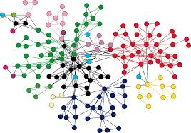

A graph is a group of points (called vertices or nodes) that are connected by lines (called edges).

### Vertices (Nodes)
These are the individual points in the graph. They represent things like cities, people, or any entities.

### Edges
Edges are the lines that connect the vertices. They can be one-way (directed) or two-way (undirected).

## Types of Graphs

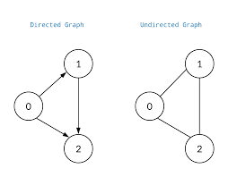

### Undirected Graph
- In this type of graph, the edges allow travel in both directions.
- For example, if there is a connection between nodes (u, v), it’s the same as the connection (v, u).

### Directed Graph (Digraph)
- Here, the edges have a direction, meaning you can only travel one way between nodes.
- For instance, the connection (u, v) is different from (v, u). We can consider that as one way road, there is a way to go from city u to city v. But you can't go back.

### Cyclic and Acyclic Graphs
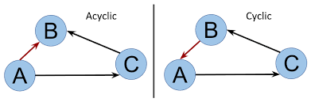
- A **cyclic graph** contains loops or cycles, meaning you can return to a starting point.
- A **Directed Acyclic Graph (DAG)** is a directed graph that has no cycles.

## Structure of Graphs
- A graph may or may not contain cycles.
- Some graphs are open (like a line) while others are closed (like a circle).

## Path in a Graph
A path is a way to connect different nodes through edges, where each node can only appear once in that path.

## Degree of a Node

### Undirected Graphs
- The degree of a node is the number of edges connected to it.
- The total degree of the graph is twice the number of edges since each edge connects two nodes.

### Directed Graphs
- **Indegree**: The number of edges coming into a node.
- **Outdegree**: The number of edges going out from a node.

## Edge Weight
- Some edges have weights, which can represent costs or distances between nodes.
- If no weight is given, it is assumed to be 1 by default.

# Graph Representation

Graphs can be represented in various ways in Java. The two most common representations are:

## 1. Adjacency Matrix

An adjacency matrix is a 2D array used to represent a graph. The rows and columns represent the vertices, and the values in the matrix indicate whether there is an edge between the vertices.

### Example

```java
class Graph {
    private int[][] adjacencyMatrix;

    public Graph(int numberOfVertices) {
        adjacencyMatrix = new int[numberOfVertices][numberOfVertices];
    }

    public void addEdge(int source, int destination) {
        adjacencyMatrix[source][destination] = 1; // For directed graph
        // Uncomment the line below for undirected graph
        // adjacencyMatrix[destination][source] = 1; 
    }

    public void display() {
        for (int i = 0; i < adjacencyMatrix.length; i++) {
            for (int j = 0; j < adjacencyMatrix[i].length; j++) {
                System.out.print(adjacencyMatrix[i][j] + " ");
            }
            System.out.println();
        }
    }
}
```

### Key Points:
- Space Complexity: O(V^2)
- Adding an Edge: O(1)
- Removing an Edge: O(1)
- Checking if an Edge Exists: O(1)
- Iterating over All Edges: O(V^2)
- Efficient for dense graphs but uses more space

## 2. Adjacency List

An adjacency list uses a list to represent a graph. Each vertex has a list of adjacent vertices. This representation is more space-efficient for sparse graphs.

```Java
class Graph {
    private List<List<Integer>> adjacencyList;

    public Graph(int numberOfVertices) {
        adjacencyList = new ArrayList<>(numberOfVertices);
        for (int i = 0; i < numberOfVertices; i++) {
            adjacencyList.add(new ArrayList<>());
        }
    }

    public void addEdge(int source, int destination) {
        adjacencyList.get(source).add(destination); // For directed graph
        // Uncomment the line below for undirected graph
        // adjacencyList.get(destination).add(source);
    }

    public void display() {
        for (int i = 0; i < adjacencyList.size(); i++) {
            System.out.print("Vertex " + i + ": ");
            for (int neighbor : adjacencyList.get(i)) {
                System.out.print(neighbor + " ");
            }
            System.out.println();
        }
    }
}
```

### Key Points:
- Space Complexity: O(V + E)
- Adding an Edge: O(1)
- Removing an Edge: O(V)
- Checking if an Edge Exists: O(V)
- Iterating over All Edges: O(E)
- More space-efficient for sparse graphs

# Graph Traversal

## BFS
Breadth-First Search (BFS) is an algorithm for traversing or searching tree or graph data structures. It explores all the neighbor nodes at the present depth before moving on to nodes at the next depth level. BFS is commonly used to find the shortest path in unweighted graphs.

## Steps of BFS
1. **Initialize**:
    - Create a queue to keep track of the nodes to be explored.
    - Create a list or set to track visited nodes.

2. **Enqueue the Starting Node**:
    - Add the starting node (source) to the queue and mark it as visited.

3. **Dequeue a Node**:
    - Remove the node from the front of the queue.

4. **Process the Node**:
    - Perform the desired operation (e.g., print the node).

5. **Enqueue All Adjacent Nodes**:
    - For each unvisited adjacent node, mark it as visited and enqueue it.

6. **Repeat**:
    - Repeat steps 3-5 until the queue is empty.
    
```java
class Solution {
    public ArrayList<Integer> bfsOfGraph(int V,
                                         ArrayList<ArrayList<Integer>> adj) {

        ArrayList < Integer > bfs = new ArrayList < > ();
        boolean vis[] = new boolean[V];
        Queue < Integer > q = new LinkedList < > ();

        q.add(0);
        vis[0] = true;

        while (!q.isEmpty()) {
            Integer node = q.poll();
            bfs.add(node);

            // Get all adjacent vertices of the dequeued vertex s
            // If a adjacent has not been visited, then mark it
            // visited and enqueue it
            for (Integer it: adj.get(node)) {
                if (vis[it] == false) {
                    vis[it] = true;
                    q.add(it);
                }
            }
        }

        return bfs;
    }

    public static void main(String args[]) {

        ArrayList < ArrayList < Integer >> adj = new ArrayList < > ();
        for (int i = 0; i < 5; i++) {
            adj.add(new ArrayList < > ());
        }
        
        adj.get(4).add(0);
        adj.get(1).add(2);
        adj.get(2).add(1);
        adj.get(1).add(3);
        adj.get(3).add(1);
        adj.get(0).add(1);
        adj.get(1).add(0);
        adj.get(0).add(4);
      

        Solution sl = new Solution();
        ArrayList < Integer > ans = sl.bfsOfGraph(5, adj);
        int n = ans.size();
        for(int i = 0;i<n;i++) {
            System.out.print(ans.get(i)+" ");
        }
    }
}
```

### Key Points:
- Uses a queue for traversal
- Explores nodes level by level
- Time Complexity: O(V + E)
- Space Complexity: O(V)
- Useful for finding shortest path in unweighted graphs
- If we have more than one components in graph then we need to iterate all the vertices and if !visited then need to call *bfsFromVertex()*.

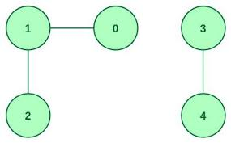

```
 for (int i = 0; i < V; i++) {
        if (!vis[i]) {  // Check if the node is unvisited
            bfsFromVertex(i, vis, adj, bfs); // Start BFS for each unvisited node
        }
}
```

## DFS

Depth-First Search (DFS) is an algorithm used to traverse or search through the nodes of a graph. Unlike BFS, which explores neighbors level by level, DFS explores as far down a branch as possible before backtracking. It is useful for exploring all possible paths in a graph and is often used in applications like maze solving, topological sorting, and cycle detection.

## Steps of DFS
1. **Initialize**:
    - Create a stack (or use recursion) to keep track of nodes to visit.
    - Create a list or array to track visited nodes.

2. **Start from a Node**:
    - Push the starting node onto the stack and mark it as visited.

3. **Explore the Graph**:
    - While there are nodes in the stack:
        - Pop a node from the stack.
        - Process the node (e.g., print it or check its edges).
        - Push all unvisited adjacent nodes onto the stack and mark them as visited.

4. **Backtrack**:
    - If there are no unvisited adjacent nodes, backtrack to the previous node by popping from the stack.

5. **Repeat**:
    - Continue until all nodes in the connected component are visited.

### Key Points:
- Uses recursion or a stack for traversal
- Explores as far as possible along each branch before backtracking
- Time Complexity: O(V + E)
- Space Complexity: O(V)
- Useful for topological sorting and cycle detection

```java
import java.util.ArrayList;
import java.util.Stack;

class Solution {
    public ArrayList<Integer> dfsOfGraph(int V, ArrayList<ArrayList<Integer>> adj) {
        ArrayList<Integer> dfs = new ArrayList<>();
        boolean[] vis = new boolean[V];

        for (int i = 0; i < V; i++) {
            if (!vis[i]) {  // Check if the node is unvisited
                dfsFromVertex(i, vis, adj, dfs); // Start DFS for each unvisited node
            }
        }

        return dfs;
    }

    private void dfsFromVertex(int node, boolean[] vis, ArrayList<ArrayList<Integer>> adj, ArrayList<Integer> dfs) {
        vis[node] = true; // Mark the node as visited
        dfs.add(node); // Process the node

        // Explore all adjacent vertices
        for (Integer neighbor : adj.get(node)) {
            if (!vis[neighbor]) { // If the neighbor has not been visited
                dfsFromVertex(neighbor, vis, adj, dfs); // Recursively call DFS for the neighbor
            }
        }
    }

    public static void main(String args[]) {
        ArrayList<ArrayList<Integer>> adj = new ArrayList<>();
        for (int i = 0; i < 5; i++) {
            adj.add(new ArrayList<>());
        }

        // Constructing the graph
        adj.get(0).add(1);
        adj.get(1).add(0);
        adj.get(1).add(2);
        adj.get(2).add(1);
        adj.get(1).add(3);
        adj.get(3).add(1);
        adj.get(4).add(0);

        Solution sl = new Solution();
        ArrayList<Integer> ans = sl.dfsOfGraph(5, adj);
        for (int node : ans) {
            System.out.print(node + " ");
        }
    }
}
```

## Cycle Detection in Undirected Graph using BFS
**Hint:** Do BFS, If from a node 'u', you visited node 'v' & if 'v' is already visited and also if 'v' is not parent of 'u' then we can say cycle is there.

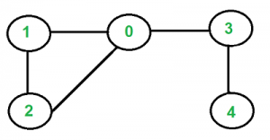

```Java
class Solution {
    boolean checkForCycle(ArrayList<ArrayList<Integer>> adj, int s,
                          boolean vis[]) {
        Queue<Node> q = new LinkedList<>(); //BFS
        q.add(new Node(s, -1));
        vis[s] = true;

        // until the queue is empty
        while (!q.isEmpty()) {
            // source node and its parent node
            int node = q.peek().first;
            int par = q.peek().second;
            q.remove();

            // go to all the adjacent nodes
            for (Integer it : adj.get(node)) {
                if (vis[it] == false) {
                    q.add(new Node(it, node));
                    vis[it] = true;
                }

                // if adjacent node is visited and is not its own parent node
                else if (par != it) return true;
            }
        }

        return false;
    }
}
```
### Key Points:
- Checks if a visited node is not the parent of the current node
- Time Complexity: O(V + E)
- Space Complexity: O(V)

## Cycle Detection in Undirected Graph using DFS

**Hint:** If adjacent node (next node) is already visited then cycle is present

In DFS call we will pass parent and we will check one more condition 

**else if (par != it) return true;**

```Java
class Solution {
    public boolean checkForCycle(int node, int parent, boolean vis[], ArrayList<ArrayList
            <Integer>> adj) {
        vis[node] = true;
        for (Integer it : adj.get(node)) {
            if (vis[it] == false) {
                if (checkForCycle(it, node, vis, adj) == true)
                    return true;
            } else if (it != parent)
                return true;
        }

        return false;
    }

    // 0-based index
    public boolean isCycle(int V, ArrayList < ArrayList < Integer >> adj) {
        boolean vis[] = new boolean[V];
        for (int i = 0; i < V; i++) {
            if (vis[i] == false) {
                if (checkForCycle(i, -1, vis, adj))
                    return true;
            }
        }
        return false;
    }
}
```
### Key Points:
- Checks if a visited node is not the parent of the current node
- Time Complexity: O(V + E)
- Space Complexity: O(V)

## Bipartite Graph (BFS) | Graph Coloring:

A Graph that can be colored using 2 colors such that no two adjacent nodes have same color is called as Bipartite Graph

- Use BFS to traverse the graph, coloring nodes alternately with two colors.
- For each node, color all its uncolored neighbors with the opposite color.
- If you encounter an already-colored neighbor with the same color as the current node, the graph is not bipartite.

```Java
class Solution {
    public boolean isBipartite(int[][] graph) {
        int[] visited = new int[graph.length];
        for(int i=0; i< graph.length;i++){
            if(visited[i]==0 && !helper(graph,i,1,visited)){
                return false;
            }
        }
        return true;
    }

    public boolean helper(int[][] graph, int n, int color, int[] visited) {

        Queue<Integer> queue = new LinkedList<>();

        queue.add(n);
        visited[n] = color;
        while(!queue.isEmpty()){
            int size = queue.size();
            System.out.println(size);
            while(size>0){
                int node = queue.remove();
                int nearestColor = visited[node];
                for(int i=0; i< graph[node].length;i++){
                    int nextNode = graph[node][i];
                    if(visited[nextNode] == 0){
                        visited[nextNode] = -nearestColor;
                        queue.add(nextNode);
                    }else{
                        if(visited[nextNode]== nearestColor){
                            return false;
                        }
                    }
                }
                size--;
            }
        }

        return true;
    }
}
```

## Bipartite Graph (DFS)

- Use BFS to traverse the graph, coloring nodes alternately with two colors.
- For each node, color all its uncolored neighbors with the opposite color.
- If you encounter an already-colored neighbor with the same color as the current node, the graph is not bipartite.

```Java
class Solution {
    public boolean isBipartite(int[][] graph) {
        int[] visited = new int[graph.length];
        for(int i=0; i< graph.length;i++){
            if(visited[i]==0 && !helper(graph,i,1,visited)){
                return false;
            }
        }
        return true;
    }

    public boolean helper(int[][] graph, int i, int color, int[] visited) {
        if(visited[i]!= 0){
            if(visited[i]!= color){
                return false;
            }
            return true;
        }

        visited[i] = color;
        for(int node: graph[i]){
            if(!helper(graph, node, -color, visited)){
                    return false;
            }
        }
        return true;
    }
}
```

## Cycle Detection in Directed Graph Using DFS
```
3 ---> 4    3 -------4
|      |    |        |
|      |    |        |
V      V    |        |
6 ---> 5    6--------5
No Cycle      Cycle
```

So, we can't use idea of cycle detection of undirected graph

**Hint:**
- **Initialize Structures:** Create two sets—one for tracking visited nodes and another for nodes currently in the path (recursion stack).

- **DFS Traversal:** Start a DFS traversal from each unvisited node. For each node you visit, add it to the current path set.

- **Cycle Detection:** While exploring a node’s neighbors, if you encounter a node that is already in the current path set, a cycle is detected.

- **Backtracking:** After exploring all neighbors of a node, remove it from the current path set before backtracking to the previous node.

```Java
class solution{
    private static boolean checkCycle(int node,  ArrayList<ArrayList<Integer>> adj, int vis[], int dfsVis[]) {
        vis[node] = 1;
        dfsVis[node] = 1;

        for(Integer neighbor: adj.get(node)) {
            if(vis[neighbor] == 0) {
                if(checkCycle(neighbor, adj, vis, dfsVis) == true) {
                    return true;
                }
            } else if(dfsVis[neighbor] == 1) {
                return true;
            }
        }
        dfsVis[node] = 0;
        return false;
    }
}
```

### Key Points:
- Uses two arrays: one for visited nodes and one for nodes in the current path
- remove current path in backtracking
- Time Complexity: O(V + E)
- Space Complexity: O(V)

## Topological Sort
Topological sorting is linear ordering of vertices such that if there is an edge u -> v then u appears before v in that ordering


## Example
Imagine you are managing a software development project with several tasks that need to be completed in a specific order. Some tasks depend on the completion of others before they can start.

### Tasks:
- **Task A**: Requirements Gathering
- **Task B**: Design
- **Task C**: Implementation
- **Task D**: Testing
- **Task E**: Deployment

### Dependencies:
- Task A must be completed before Task B can start.
- Task A must be completed before Task C can start.
- Task B must be completed before Task D can start.
- Task C must be completed before Task D can start.
- Task D must be completed before Task E can start.

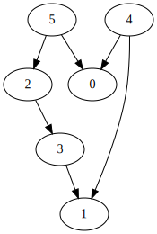

For above image, One of the possible topological sort: 5, 4, 2, 3, 1, 0 (edge will be left to right)
## Topological sort using DFS
**Topological Sort is possible for only DAG**

**Hint:**
- Maintain visited array & a satck to store the topological sort
- If adjacent of the node are done then push the node into stack (means we already have adjacent nodes into stack)

```Java
class Solution{
    static void findTopoSort(int node, int vis[], ArrayList<ArrayList<Integer>> adj, Stack<Integer> st) {
        vis[node] = 1;
        for(Integer it: adj.get(node)) {
            if(vis[it] == 0) {
                findTopoSort(it, vis, adj, st);
            }
        }
        st.push(node);
    }
    static int[] topoSort(int N, ArrayList<ArrayList<Integer>> adj) {
        Stack<Integer> st = new Stack<Integer>();
        int vis[] = new int[N];

        for(int i = 0;i<N;i++) {
            if(vis[i] == 0) {
                findTopoSort(i, vis, adj, st);
            }
        }

        int topo[] = new int[N];
        int ind = 0;
        while(!st.isEmpty()) {
            topo[ind++] = st.pop();
        }
        // for(int i = 0;i<N;i++) System.out.println(topo[i] + " "); 
        return topo;
    }
}
```
### Key Points:
- Works only on Directed Acyclic Graphs (DAGs)
- Uses a stack to store nodes after exploring all neighbors
- Time Complexity: O(V + E)
- Space Complexity: O(V)

## Topological sort using BFS | Kahn's Algo
***Hint:**
- Node will lesser indegree will come before greater indegree

### Steps:

1. Calculate in-degree (number of incoming edges) for each vertex and store it in an array.

2. Create a queue and add all vertices with in-degree 0 to it.

3. Initialize an empty list to store the topological order.

4. While the queue is not empty:
    - Remove a vertex from the queue (dequeue)
    - Add it to the topological order list
    - Reduce in-degree by 1 for all its neighboring vertices
    - If in-degree of a neighboring vertex becomes 0, add it to the queue

5. If the topological order list contains all vertices, return it. Otherwise, the graph has at least one cycle.

```Java
class Solution {
    // Function to return list containing vertices in Topological order.
    static int[] topoSort(int V, ArrayList<ArrayList<Integer>> adj) {
        int indegree[] = new int[V];
        for (int i = 0; i < V; i++) {
            for (int it : adj.get(i)) {
                indegree[it]++;
            }
        }

        Queue<Integer> q = new LinkedList<Integer>();
        ;
        for (int i = 0; i < V; i++) {
            if (indegree[i] == 0) {
                q.add(i);
            }
        }

        int topo[] = new int[V];
        int i = 0;
        while (!q.isEmpty()) {
            int node = q.peek();
            q.remove();
            topo[i++] = node;
            // node is in your topo sort
            // so please remove it from the indegree

            for (int it : adj.get(node)) {
                indegree[it]--;
                if (indegree[it] == 0) {
                    q.add(it);
                }
            }
        }

        return topo;
    }
}

```
### Key Points:
- Works only for Directed Acyclic Graphs (DAGs)
- Detects cycles in the graph
- Time Complexity: O(V + E), where V is the number of vertices and E is the number of edges
- Space Complexity: O(V)

## Shortest Path in weighted DAG
**Given a source node, find shortest path length from src to every other node**

**Hint:**
1) Store topological sort in stack using dfs
2) Make a distance array, mark src as 0 & all other node as ∞
3) While Stack is not empty
   - pop element, for example U
   - see the adjacents node of u, dist of adjacent node = MIN(dist[adj_node], dist[U] + weight on edge of U & adj. node)

```Java
class Solution {
  private void topoSort(int node, ArrayList < ArrayList < Pair >> adj,
    int vis[], Stack < Integer > st) {
    //This is the function to implement Topological sort. 

    vis[node] = 1;
    for (int i = 0; i < adj.get(node).size(); i++) {
      int v = adj.get(node).get(i).first;
      if (vis[v] == 0) {
        topoSort(v, adj, vis, st);
      }
    }
    st.add(node);
  }
  public int[] shortestPath(int N, int M, int[][] edges) {
    ArrayList < ArrayList < Pair >> adj = new ArrayList < > ();
    for (int i = 0; i < N; i++) {
      ArrayList < Pair > temp = new ArrayList < Pair > ();
      adj.add(temp);
    }
    //We create a graph first in the form of an adjacency list.

    for (int i = 0; i < M; i++) {
      int u = edges[i][0];
      int v = edges[i][1];
      int wt = edges[i][2];
      adj.get(u).add(new Pair(v, wt));
    }
    int vis[] = new int[N];
    //Now, we perform topo sort using DFS technique 
    //and store the result in the stack st.

    Stack < Integer > st = new Stack < > ();
    for (int i = 0; i < N; i++) {
      if (vis[i] == 0) {
        topoSort(i, adj, vis, st);
      }
    }
    //Further, we declare a vector ‘dist’ in which we update the value of the nodes’
    //distance from the source vertex after relaxation of a particular node.
    int dist[] = new int[N];
    for (int i = 0; i < N; i++) {
      dist[i] = (int)(1e9);
    }

    dist[0] = 0;
    while (!st.isEmpty()) {
      int node = st.peek();
      st.pop();

      for (int i = 0; i < adj.get(node).size(); i++) {
        int v = adj.get(node).get(i).first;
        int wt = adj.get(node).get(i).second;

        if (dist[node] + wt < dist[v]) {
          dist[v] = wt + dist[node];
        }
      }
    }

    for (int i = 0; i < N; i++) {
      if (dist[i] == 1e9) dist[i] = -1;
    }
    return dist;
  }
}
```

### Dijktra's Algorithm
**Given a weighted undircetd graph, find shortest path from src node to every other node**

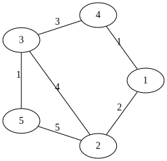

**Hint:**
1) Maintain a min heap of pair {distance, node}
2) Make a distance array, mark src as 0 & all other node as ∞
3) While Min Heap is not empty
   - take top element, for example U
   - find better distance, update in visited array & push into heap
   

```Java
class Solution
{
    //Function to find the shortest distance of all the vertices
    //from the source vertex S.
    static int[] dijkstra(int V, ArrayList<ArrayList<ArrayList<Integer>>> adj, int S)
    {
        // Create a priority queue for storing the nodes as a pair {dist, node
        // where dist is the distance from source to the node.  
        PriorityQueue<Pair> pq = 
        new PriorityQueue<Pair>((x,y) -> x.distance - y.distance);
        
        int []dist = new int[V]; 
      
        // Initialising distTo list with a large number to
        // indicate the nodes are unvisited initially.
        // This list contains distance from source to the nodes.
        for(int i = 0;i<V;i++) dist[i] = (int)(1e9); 
        
        // Source initialised with dist=0.
        dist[S] = 0;
        pq.add(new Pair(0,S)); 
        
        // Now, pop the minimum distance node first from the min-heap
        // and traverse for all its adjacent nodes.
        while(pq.size() != 0) {
            int dis = pq.peek().distance; 
            int node = pq.peek().node; 
            pq.remove(); 
            
            // Check for all adjacent nodes of the popped out
            // element whether the prev dist is larger than current or not.
            for(int i = 0;i<adj.get(node).size();i++) {
                int edgeWeight = adj.get(node).get(i).get(1); 
                int adjNode = adj.get(node).get(i).get(0); 
                
                // If current distance is smaller,
                // push it into the queue.
                if(dis + edgeWeight < dist[adjNode]) {
                    dist[adjNode] = dis + edgeWeight; 
                    pq.add(new Pair(dist[adjNode], adjNode)); 
                }
            }
        }
        // Return the list containing shortest distances
        // from source to all the nodes.
        return dist; 
    }
}
```

### Bellman Form Algorithm

**The Bellman-Ford algorithm is used to find the shortest paths from a single source to all vertices in a graph, including graphs with negative weight edges.**
- If graph have negative weight then dijkstra's algo will not work
- This algo also help to find negative cycle

1) Relaxation: The Bellman-Ford algorithm is based on a concept called relaxation. Relaxation involves trying to improve the shortest path to a vertex by checking if a path through another vertex provides a shorter path.

2) For every edge (u, v) with weight w, if the current known distance to v is greater than the distance to u plus w (i.e., distance[u] + w < distance[v]), then update the distance to v through u.
Iterative Approach: Bellman-Ford repeats this relaxation process for all edges in the graph. This is done exactly V-1 times, where V is the number of vertices. After V-1 iterations, the shortest paths from the source to all vertices are guaranteed to be found (if no negative weight cycle exists).


**Why V-1 times?** Because the shortest path can have at most V-1 edges, so after V-1 relaxations, all shortest paths are discovered.

3) Negative Weight Cycle Detection: If further relaxation is possible after V-1 iterations, it means that a shorter path is still being found, which indicates the presence of a negative weight cycle.

```Java
class Solution{
    
static int[] bellman_ford(int V,
ArrayList<ArrayList<Integer>> edges, int S) {
   int[] dist = new int[V];
   for (int i = 0; i < V; i++) dist[i] = (int)(1e8);
   dist[S] = 0;
   // V x E
   for (int i = 0; i < V - 1; i++) {
       for (ArrayList<Integer> it : edges) {
           int u = it.get(0);
           int v = it.get(1);
           int wt = it.get(2);
           if (dist[u] != 1e8 && dist[u] + wt < dist[v]) {
               dist[v] = dist[u] + wt;
           }
       }
   }
   // Nth relaxation to check negative cycle
   for (ArrayList<Integer> it : edges) {
       int u = it.get(0);
       int v = it.get(1);
       int wt = it.get(2);
       if (dist[u] != 1e8 && dist[u] + wt < dist[v]) {
           int temp[] = new int[1];
           temp[0] = -1;
           return temp;
       }
   }
   return dist;
}
}

```
## Floyd Warshall Algorithm

**The problem is to find the shortest distances between every pair of vertices in a given edge-weighted directed graph.**

The graph is represented as an adjacency matrix of size n*n. Matrix[i][j] denotes the weight of the edge from i to j. If Matrix[i][j]=-1, it means there is no edge from i to j.

```
Input Format:
matrix[][] = { {0, 2, -1, -1},
{1, 0, 3, -1},{-1, -1, 0, -1},{3, 5, 4, 0} }


Result:
0 2 5 -1
1 0 3 -1
-1 -1 0 -1
3 5 4 0
```
**Explanation:** In this example, the final matrix
is storing the shortest distances. For example, matrix[i][j] is
storing the shortest distance from node i to j.

Dijkstra’s Shortest Path algorithm and Bellman-Ford algorithm are single-source shortest path algorithms where we are given a single source node and are asked to find out the shortest path to every other node from that given source. But in the Floyd Warshall algorithm, we need to figure out the shortest distance from each node to every other node.

Basically, the Floyd Warshall algorithm is a multi-source shortest path algorithm and it helps to detect negative cycles as well. The shortest path between node u and v necessarily means the path(from u to v) for which the sum of the edge weights is minimum.

In Floyd Warshall’s algorithm, we need to check every possible path going via each possible node. And after checking every possible path, we will figure out the shortest path(a kind of brute force approach to find the shortest path).

**How to detect a negative cycle using the Floyd Warshall algorithm?**

In a graph without negative cycles, the distance from any vertex to itself should be 0. If we find a negative distance from a vertex to itself after running Floyd-Warshall, it indicates the presence of a negative cycle.

```Java
class Solution {
   public void shortest_distance(int[][] matrix) {
      int n = matrix.length;
      for (int i = 0; i < n; i++) {
         for (int j = 0; j < n; j++) {
            if (matrix[i][j] == -1) {
               matrix[i][j] = (int) (1e9);
            }
            if (i == j) matrix[i][j] = 0;
         }
      }

      for (int k = 0; k < n; k++) {
         for (int i = 0; i < n; i++) {
            for (int j = 0; j < n; j++) {
               matrix[i][j] = Math.min(matrix[i][j],
                       matrix[i][k] + matrix[k][j]);
            }
         }
      }

      for (int i = 0; i < n; i++) {
         for (int j = 0; j < n; j++) {
            if (matrix[i][j] == (int) (1e9)) {
               matrix[i][j] = -1;
            }
         }
      }
   }
}

```
## MST (Minimum Spanning Tree)
- If graph has N nodes then spanning tree will have N nodes and N-1 edges
- MST is spanning tree with minimum cost


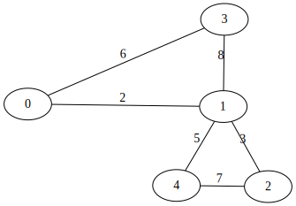

#### Output

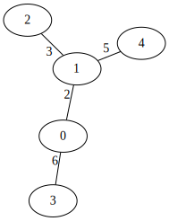


### Prims's Algorithm
- Used to find MST

**Hint:**
1) Take any one node for tree
2) Now check the adjacent edge of all the nodes taken till now in the tree & take the edge with minimum weight
3) Repeat step 2 N-1 times

Take the edge with minimum weight --> We need priority Queue (Min Heap)

```Java
class Edge {
   int destination;
   int weight;

   Edge(int destination, int weight) {
      this.destination = destination;
      this.weight = weight;
   }
}

public class PrimsAlgorithm {
   public static void main(String[] args) {
      int vertices = 5; 
      List<List<Edge>> graph = new ArrayList<>(vertices);

      for (int i = 0; i < vertices; i++) {
         graph.add(new ArrayList<>());
      }

      addEdge(graph, 0, 1, 2);
      addEdge(graph, 0, 3, 6);
      addEdge(graph, 1, 2, 3);
      addEdge(graph, 1, 3, 8);
      addEdge(graph, 1, 4, 5);
      addEdge(graph, 2, 4, 7);
      addEdge(graph, 3, 0, 6);
      addEdge(graph, 3, 1, 8);
      addEdge(graph, 4, 1, 5);
      addEdge(graph, 4, 2, 7);

      primsMST(graph, vertices);
   }

   private static void addEdge(List<List<Edge>> graph, int source, int destination, int weight) {
      graph.get(source).add(new Edge(destination, weight));
      graph.get(destination).add(new Edge(source, weight)); // For undirected graph
   }

   private static void primsMST(List<List<Edge>> graph, int vertices) {
      boolean[] inMST = new boolean[vertices];
      PriorityQueue<Edge> pq = new PriorityQueue<>(Comparator.comparingInt(e -> e.weight));

      // Start from the first vertex
      inMST[0] = true;
      for (Edge edge : graph.get(0)) {
         pq.offer(edge);
      }

      int totalWeight = 0;
      System.out.println("Edges in the Minimum Spanning Tree:");

      while (!pq.isEmpty()) {
         Edge minEdge = pq.poll();
         int dest = minEdge.destination;

         // If the destination vertex is already included in the MST, skip it
         if (inMST[dest]) {
            continue;
         }

         // Include the edge in the MST
         inMST[dest] = true;
         totalWeight += minEdge.weight;
         System.out.println("Edge: 0 - " + dest + " with weight " + minEdge.weight);

         // Add edges from the newly added vertex to the priority queue
         for (Edge edge : graph.get(dest)) {
            if (!inMST[edge.destination]) {
               pq.offer(edge);
            }
         }
      }

      System.out.println("Total weight of the Minimum Spanning Tree: " + totalWeight);
   }
}

```
### Disjoint Set
# Disjoint Set (Union-Find)

## What is a Disjoint Set?

A **Disjoint Set**, also known as a **Union-Find** data structure, is a collection of non-overlapping (disjoint) sets. It provides efficient methods for:

1. **Union**: Merging two sets into a single set.
2. **Find**: Determining which set a particular element belongs to.

### Key Techniques

- **Path Compression**: Optimizes the `find` operation by flattening the structure of the tree whenever `find` is called, which speeds up future queries.
- **Union by Rank**: Optimizes the `union` operation by attaching the smaller tree under the root of the larger tree, which helps keep the tree flat.

## Why Use Disjoint Set?

1. **Efficiency**: Provides near constant time operations for union and find due to optimizations, making it suitable for applications with many operations.
2. **Dynamic Connectivity**: Useful for managing a collection of disjoint sets dynamically.
3. **Graph Algorithms**: Commonly used in algorithms for finding connected components, such as Kruskal's algorithm for Minimum Spanning Trees and checking for cycles in a graph.

## When to Use Disjoint Set?

1. **Kruskal's Algorithm**: When implementing Kruskal’s algorithm for finding the Minimum Spanning Tree (MST) of a graph.

2. **Network Connectivity**: Managing and querying connectivity in networks, such as social networks.

3. **Image Processing**: Grouping pixels based on connectivity in image segmentation.

4. **Dynamic Connectivity Problems**: Any problem involving merging sets and querying membership, such as connectivity queries in dynamic graphs.

```java
class DisjointSet {
   List<Integer> rank = new ArrayList<>();
   List<Integer> parent = new ArrayList<>();
   public DisjointSet(int n) {
      for (int i = 0; i <= n; i++) {
         rank.add(0);
         parent.add(i);
      }
   }

   public int findUPar(int node) {
      if (node == parent.get(node)) {
         return node;
      }
      int ulp = findUPar(parent.get(node));
      parent.set(node, ulp);
      return parent.get(node);
   }

   public void unionByRank(int u, int v) {
      int ulp_u = findUPar(u);
      int ulp_v = findUPar(v);
      if (ulp_u == ulp_v) return;
      if (rank.get(ulp_u) < rank.get(ulp_v)) {
         parent.set(ulp_u, ulp_v);
      } else if (rank.get(ulp_v) < rank.get(ulp_u)) {
         parent.set(ulp_v, ulp_u);
      } else {
         parent.set(ulp_v, ulp_u);
         int rankU = rank.get(ulp_u);
         rank.set(ulp_u, rankU + 1);
      }
   }

}

class Main {
   public static void main (String[] args) {
      DisjointSet ds = new DisjointSet(7);
      ds.unionByRank(1, 2);
      ds.unionByRank(2, 3);
      ds.unionByRank(4, 5);
      ds.unionByRank(6, 7);
      ds.unionByRank(5, 6);

      // if 3 and 7 same or not
      if (ds.findUPar(3) == ds.findUPar(7)) {
         System.out.println("Same");
      } else
         System.out.println("Not Same");

      ds.unionByRank(3, 7);
      if (ds.findUPar(3) == ds.findUPar(7)) {
         System.out.println("Same");
      } else
         System.out.println("Not Same");
   }
}

```
### Kruskal's Algorithm
- used to find MST
- It is an application of Disjoint Set

**Hint:**
1) Sort all edges in array & sort them all their weights
2) Keep taking the edge with lesser weight if corresponding node does not belongs to the component to avoid cycle

```Java
public class KruskalMST {
   public static void kruskal(Edge[] edges, int vertices) {
      Arrays.sort(edges); // Sort edges by weight

      DisjointSet ds = new DisjointSet(vertices);
      Edge[] mst = new Edge[vertices - 1]; // Array to store MST edges
      int edgeCount = 0;

      for (Edge edge : edges) {
         int u = edge.source;
         int v = edge.destination;

         // If u and v are in different components, include this edge
         if (ds.find(u) != ds.find(v)) {
            ds.union(u, v); // Union the sets
            mst[edgeCount++] = edge; // Add edge to the MST
         }
      }

      // Print the resulting MST
      System.out.println("Minimum Spanning Tree:");
      for (Edge edge : mst) {
         if (edge != null) {
            System.out.println(edge.source + " -- " + edge.destination + " == " + edge.weight);
         }
      }
   }
}
```
## Advanced Graph Algorithm

### Bridges In graph (Tarjan's Algorithm)
**An edge is called as bridge if its removal increase number of component**

Ex: If only one road is present between two city and it is the only connection to join two city then that road can be considered as bridge for them

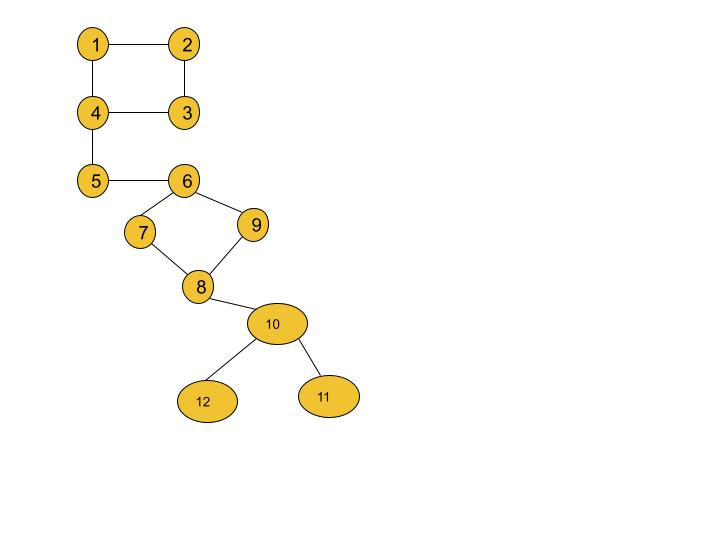

Result: [[4, 5], [5, 6], [8, 10]]

**Important**
- We will need two arrays, time of insertion and lowest time of insertion
- Insertion Time refers to when a node is visited for the first time in the DFS tree.
- Lowest Insertion Time helps us identify if there is a way to backtrack to an ancestor of a node through back edges, which determines whether an edge is a bridge or not.

#### Intuition
1) DFS Traversal: We can use Depth First Search (DFS) to traverse the graph. As we explore the graph, we try to backtrack to earlier visited nodes (or ancestors) through back edges (edges that connect a node to one of its ancestors in the DFS tree).

2) Insertion Time: As we perform DFS, we keep track of the insertion time (the time a node is first visited or "inserted" into the DFS tree). This helps us understand the order in which nodes are visited during DFS.

3) Lowest Insertion Time: The lowest insertion time of a node represents the smallest insertion time reachable from that node (including itself and its descendants), either by following tree edges (edges in the DFS tree) or back edges (edges connecting to ancestors in the DFS tree).

4) Bridge Condition: A bridge exists between two nodes u and v if and only if there is no way to reach an ancestor of u from v through any other path except via u. More formally, if the lowest insertion time of v is greater than the insertion time of u, then the edge (u, v) is a bridge.

```Java
class Solution {
    private int timer = 1;
    private void dfs(int node, int parent, int[] vis,
                     ArrayList<ArrayList<Integer>> adj, int tin[], int low[],
                     List<List<Integer>> bridges) {
        vis[node] = 1;
        tin[node] = low[node] = timer;
        timer++;
        for (Integer it : adj.get(node)) {
            if (it == parent) continue;
            if (vis[it] == 0) {
                dfs(it, node, vis, adj, tin, low, bridges);
                low[node] = Math.min(low[node], low[it]);
                // node --- it
                if (low[it] > tin[node]) {
                    bridges.add(Arrays.asList(it, node));
                }
            } else {
                low[node] = Math.min(low[node], low[it]);
            }
        }
    }
    public List<List<Integer>> criticalConnections(int n, List<List<Integer>> connections) {
        ArrayList<ArrayList<Integer>> adj =
            new ArrayList<ArrayList<Integer>>();
        for (int i = 0; i < n; i++) {
            adj.add(new ArrayList<Integer>());
        }
        for (List<Integer> it : connections) {
            int u = it.get(0); int v = it.get(1);
            adj.get(u).add(v);
            adj.get(v).add(u);
        }
        int[] vis = new int[n];
        int[] tin = new int[n];
        int[] low = new int[n];
        List<List<Integer>> bridges = new ArrayList<>();
        dfs(0, -1, vis, adj, tin, low, bridges);
        return bridges;
    }
}
```

### Articulation Point / Cut Vertex
**It is point/node/vertex whose removal increases the number of components in graph**

```
1----------2
|          |
|          |
4----------3
|
|
5
 \
  \                  Articulation Point: 4,5,6,8,10
   6
  / \
 /   \
7     9
 \   /
  \ /
   8
   |
   10----11
    \   /
     \ /
      12
```

**Hint:**
- Lowest time of insertion and time of insertion of each node will be maintained
- Focus on nodes. Removing a node will disconnect its surrounding nodes from the rest of the graph. This node is often central to many subgraphs.
- if low[adj] >= time[node] && parent!= -1 then node will be articulation point
- if parent = -1 then that means there is no upper half, so if you remove that node no. of components are not going to increase
- starting node can be articulation point as well. we need to treat that differently, if child>=1 and parent = -1 that means it is articulation point
```
    1
   / \
  2   3       Here 1 is starting point and articulation point
```

```Java
class Solution {
    private int timer = 1;
    private void dfs(int node, int parent, int[] vis,
                     int tin[], int low[], int[] mark,
                     ArrayList<ArrayList<Integer>> adj) {
        vis[node] = 1;
        tin[node] = low[node] = timer;
        timer++;
        int child = 0;
        for (Integer it : adj.get(node)) {
            if (it == parent) continue;
            if (vis[it] == 0) {
                dfs(it, node, vis, tin, low, mark, adj);
                low[node] = Math.min(low[node], low[it]);
                // node --- it
                if (low[it] >= tin[node] && parent != -1) {
                    mark[node] = 1;
                }
                child++;
            } else {
                low[node] = Math.min(low[node], tin[it]);
            }
        }
        if (child > 1 && parent == -1) {
            mark[node] = 1;
        }
    }
    //Function to return Breadth First Traversal of given graph.
    public ArrayList<Integer> articulationPoints(int n,
            ArrayList<ArrayList<Integer>> adj) {
        int[] vis = new int[n];
        int[] tin = new int[n];
        int[] low = new int[n];
        int[] mark = new int[n];
        for (int i = 0; i < n; i++) {
            if (vis[i] == 0) {
                dfs(i, -1, vis, tin, low, mark, adj);
            }
        }
        ArrayList<Integer> ans = new ArrayList<>();
        for (int i = 0; i < n; i++) {
            if (mark[i] == 1) {
                ans.add(i);
            }
        }
        if (ans.size() == 0) {
            ans.add(-1);
        }
        return ans;
    }
}

```
Time Complexity: **O(V+2E)**, where V = no. of vertices, E = no. of edges. It is because the algorithm is just a simple DFS traversal.

Space Complexity: **O(3V)**, where V = no. of vertices. O(3V) is for the three arrays i.e. tin, low, and vis, each of size V.


### Strongly connected component - Kosaraju's algo

**Given a Directed Graph with V vertices (Numbered from 0 to V-1) and E edges, Find the number of strongly connected components in the graph.**

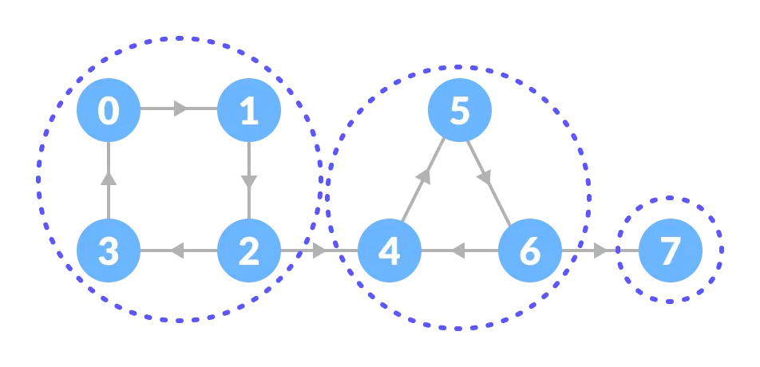

```
SCC1 --> SCC2 --> SCC3
??
SCC1 <-- SCC2 <-- SCC3

Can we visit all vertices again?
```
- It is one componet, so we can follow path then we will able to access all vertices
- what if we reverse edge? can we access all vertices again?
- If yes, then that part is one SCC

#### Intuition
1) Do a depth-first search (DFS) and make a stack.
2) Reverse all the arrows in your map.
3) Do another DFS, based on that stack.
4) Each complete DFS is one strongly connected group.

```Java
class Solution{
private void dfs(int node, int []vis, ArrayList<ArrayList<Integer>> adj,
                     Stack<Integer> st) {
        vis[node] = 1;
        for (Integer it : adj.get(node)) {
            if (vis[it] == 0) {
                dfs(it, vis, adj, st);
            }
        }
        st.push(node);
    }
    private void dfs3(int node, int[] vis, ArrayList<ArrayList<Integer>> adjT) {
        vis[node] = 1;
        for (Integer it : adjT.get(node)) {
            if (vis[it] == 0) {
                dfs3(it, vis, adjT);
            }
        }
    }
    //Function to find number of strongly connected components in the graph.
    public int kosaraju(int V, ArrayList<ArrayList<Integer>> adj) {
        int[] vis = new int[V];
        Stack<Integer> st = new Stack<Integer>();
        for (int i = 0; i < V; i++) {
            if (vis[i] == 0) {
                dfs(i, vis, adj, st);
            }
        }

        ArrayList<ArrayList<Integer>> adjT = new ArrayList<ArrayList<Integer>>();
        for (int i = 0; i < V; i++) {
            adjT.add(new ArrayList<Integer>());
        }
        for (int i = 0; i < V; i++) {
            vis[i] = 0;
            for (Integer it : adj.get(i)) {
                // i -> it
                // it -> i
                adjT.get(it).add(i);
            }
        }
        int scc = 0;
        while (!st.isEmpty()) {
            int node = st.peek();
            st.pop();
            if (vis[node] == 0) {
                scc++;
                dfs3(node, vis, adjT);
            }
        }
        return scc;
    }
}
```